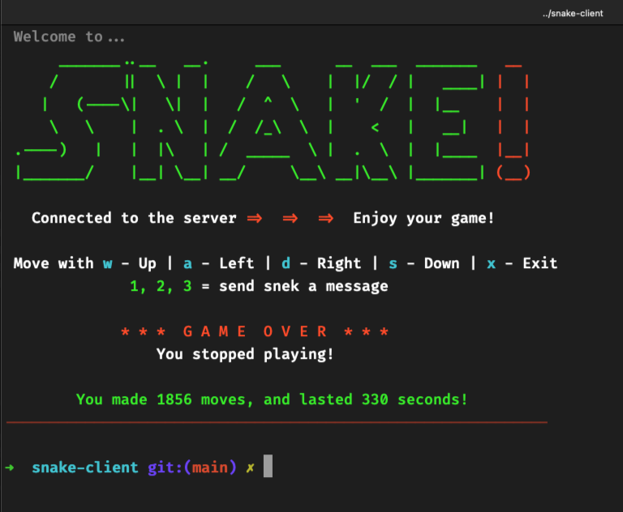
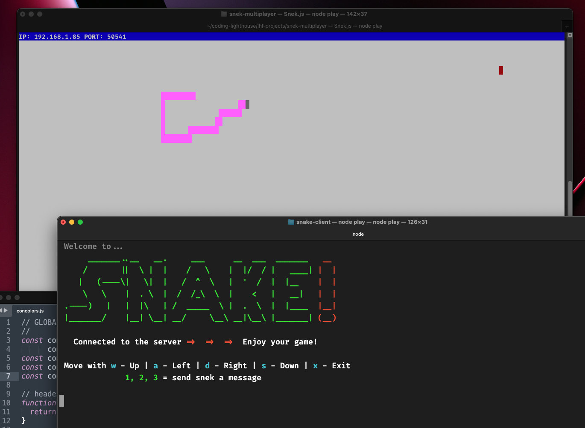

# LHL Snake Client Project

Snake game is a very popular video game. It is a video game concept where the player maneuvers a dot and grows it by ‘eating’ pieces of food. As it moves and eats, it grows and the growing snake becomes an obstacle to smooth maneuvers. The goal is to grow it to become as big as possible without bumping into the side walls, or bumping into itself, upon which it dies.

This is simply a multiplayer take on the genre.

Before you can run this client, you will need to be running the server side which you can download and install from here. 

## Final Product:

## Getting Started:

- Follow steps inside the snek server repo to run the server side.  The modified snek server is required to receive "group messages" when new players join the game, but otherwise is not necessary.
- Run the development snake client using the `node play.js` command.

## Bonus features:
- added connection error "pretty" exit instead of a harsh failure notification
- "score" counter (seconds survived)
- "score" counter (number of direction changes made)
- fancy intro with ASCII art
- trap generic server game over messages & re-phrase
- automatic snake movement after first keypress - no stopping it now!
- every time you change snake's direction, it gets faster!
- stretch feature: receive notfication if others join the game