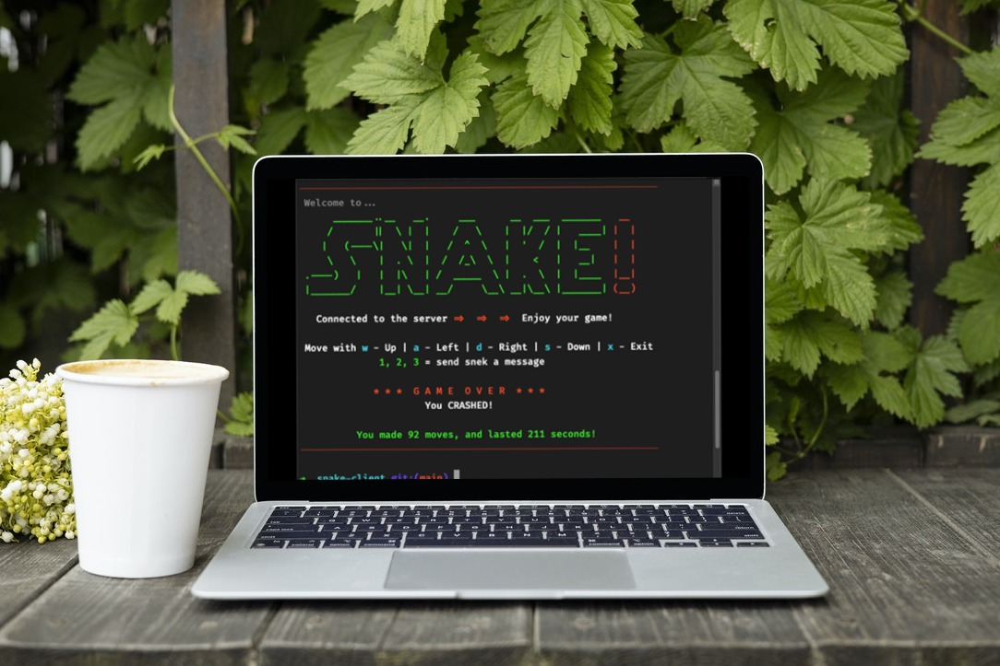

# LHL Snake Client Project
**Version 1.0**

Snake game is a very popular video game. It is a video game concept where the player maneuvers a dot and grows it by ‘eating’ pieces of food. As it moves and eats, it grows and the growing snake becomes an challenge to maneuver. The goal is to grow it to become as big as possible without bumping into the side walls, or bumping into itself, or another snake - upon which it dies.

This is simply a multiplayer take on the "snake" genre.

Before you can run this client, you will need to be running the server side which you can download and install from this repository as well. 

## Final Product:

## Getting Started:

- Follow steps inside the snake server repo to run the server side.  The modified snake server is required to receive "group messages" when new players join the game, but otherwise is not necessary.
- Run the development snake client using the `node play.js` command.
- The modified server files included here runs via `node play.js` as well.
- You may need to update the server hostname (or IP) and port information in the client side `globalVars.js` file too once you get that info from the snake server.

## Bonus Features Added:
- Added connection error "pretty" exit instead of a harsh failure notification
- "Score" counter (seconds survived)
- "Score" counter (number of direction changes made)
- Fancy intro with ASCII art
- Trap generic server game over messages & re-phrase
- Automatic snake movement (via client side) after first keypress - no stopping it now!
- Every time you change snake's direction, it gets faster!
- Stretch feature: receive notfication if others join the game

## Future Ideas:
- [ ] Error check any missing "requires" and provide clean exit if missing
- [ ] Report final snake speed at game over
- [ ] Modify server to report 'food eaten' to add to final scoring